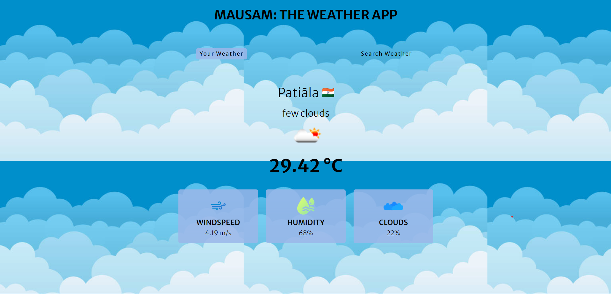

# 🌦️ Mausam: The Weather App

Mausam is your go-to web app for staying one step ahead of the weather gods! Whether you’re planning a beach day, checking if it’s raining cats and dogs, or just need to know if you should grab a jacket, Mausam’s got you covered with real-time weather updates. Built with a mix of HTML, CSS, JavaScript, and powered by the OpenWeather API, Mausam is here to help you navigate whatever weather comes your way!

## 🎯 Features

- **Real-Time Weather Updates**: Get the latest on temperature, humidity, wind speed, and more with real-time data from the OpenWeather API.
- **Geolocation Tracking**: Automatically fetches the weather for your current location so you can see the forecast right where you are—no typing required!
- **Search Any City**: Curious about the weather in Timbuktu? Just type in the city name, and Mausam will give you the scoop.
- **Sleek, User-Friendly Interface**: Designed to be as intuitive as it is informative, Mausam offers a clean, minimalistic design for effortless browsing.
- **Responsive Design**: Works seamlessly on any device, be it your laptop, tablet, or mobile—because weather knows no bounds, and neither should you!

## 📸 Screenshots

<p align="center">
  
</p>

<p align="center"><em>The sleek homepage of Mausam displaying current weather for your location. Search for any city to get real-time weather updates.</em></p>

## 🚀 Getting Started

To get a local copy up and running, follow these simple steps:

### Prerequisites

Make sure you have the following installed:

- A modern web browser (Chrome, Firefox, Edge, etc.)
- A code editor (VSCode, Sublime Text, etc.)

### Installation

1. **Clone the repository:**

    ```bash
    git clone https://github.com/divyanshdangi11/Mausam-The-Weather-App.git
    ```

2. **Navigate to the project directory:**

    ```bash
    cd mausam
    ```

3. **Open `index.html` in your browser:**

    ```bash
    open index.html
    ```
    Or simply drag the `index.html` file into your browser.

### API Key Setup

1. **Get your API key**: Head over to the [OpenWeather API](https://openweathermap.org/api) and sign up to get your free API key.

2. **Insert your API key**: Open the `main.js` file in your code editor and replace `YOUR_API_KEY_HERE` with your actual API key.

    ```javascript
    const apiKey = 'YOUR_API_KEY_HERE'; // Replace with your OpenWeather API key
    ```

## 🛠️ Built With

- **HTML** - Structure the app’s content.
- **CSS** - Add styling and responsiveness.
- **JavaScript** - Make everything interactive and fetch data from the API.
- **OpenWeather API** - Provides real-time weather data for any location worldwide.

## 💡 How It Works

1. **Geolocation**: When you open the app, it requests your location to provide instant weather updates.
2. **API Integration**: The app makes a call to the OpenWeather API to fetch real-time data, including temperature, humidity, and wind speed.
3. **Dynamic UI**: The app updates the UI dynamically based on the data received, showing you current conditions or the forecast for your searched location.

## 🌍 Contributing

Contributions are what make the open-source community such a fantastic place to learn, inspire, and create. Any contributions you make are greatly appreciated.

1. **Fork the Project**
2. **Create your Feature Branch** (`git checkout -b feature/AmazingFeature`)
3. **Commit your Changes** (`git commit -m 'Add some AmazingFeature'`)
4. **Push to the Branch** (`git push origin feature/AmazingFeature`)
5. **Open a Pull Request**

## 📜 License

Distributed under the MIT License. See `LICENSE` for more information.

## 📧 Contact

**Name** - Divyansh Dangi  
**Email** - ddangi_be21@thapar.edu  
**Project Live Link** - [Mausam App](https://divyansh-dangi-weather-app.netlify.app/)  
**Portfolio** - [Divyansh's Portfolio](https://divyansh-dangi-portfolio.netlify.app/)
